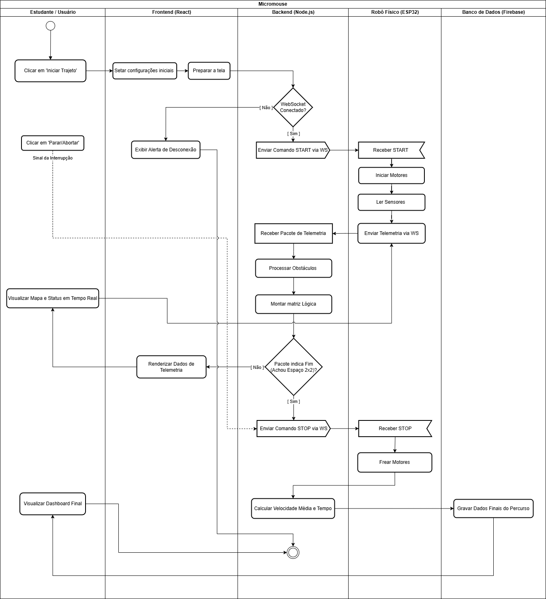
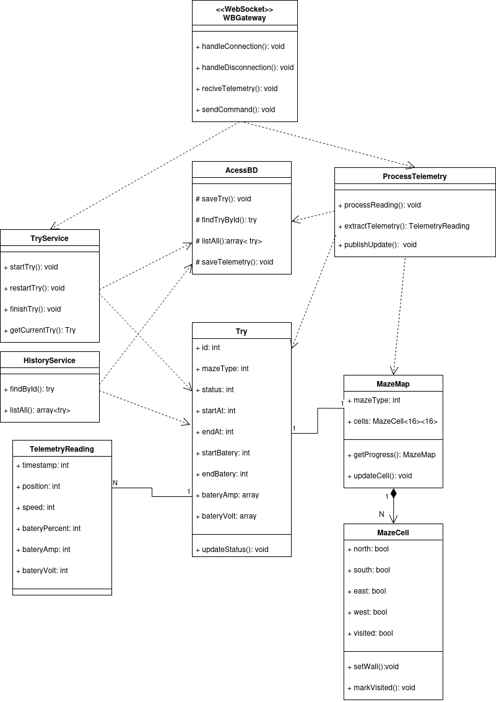
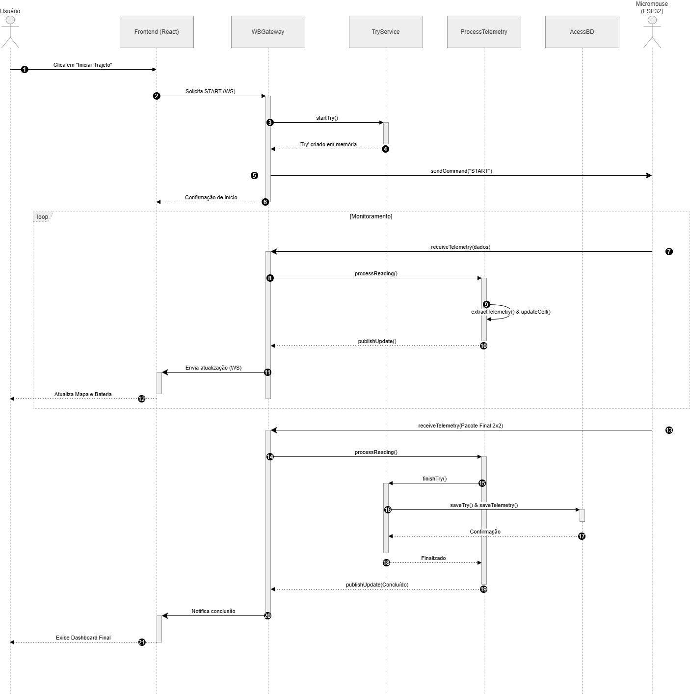
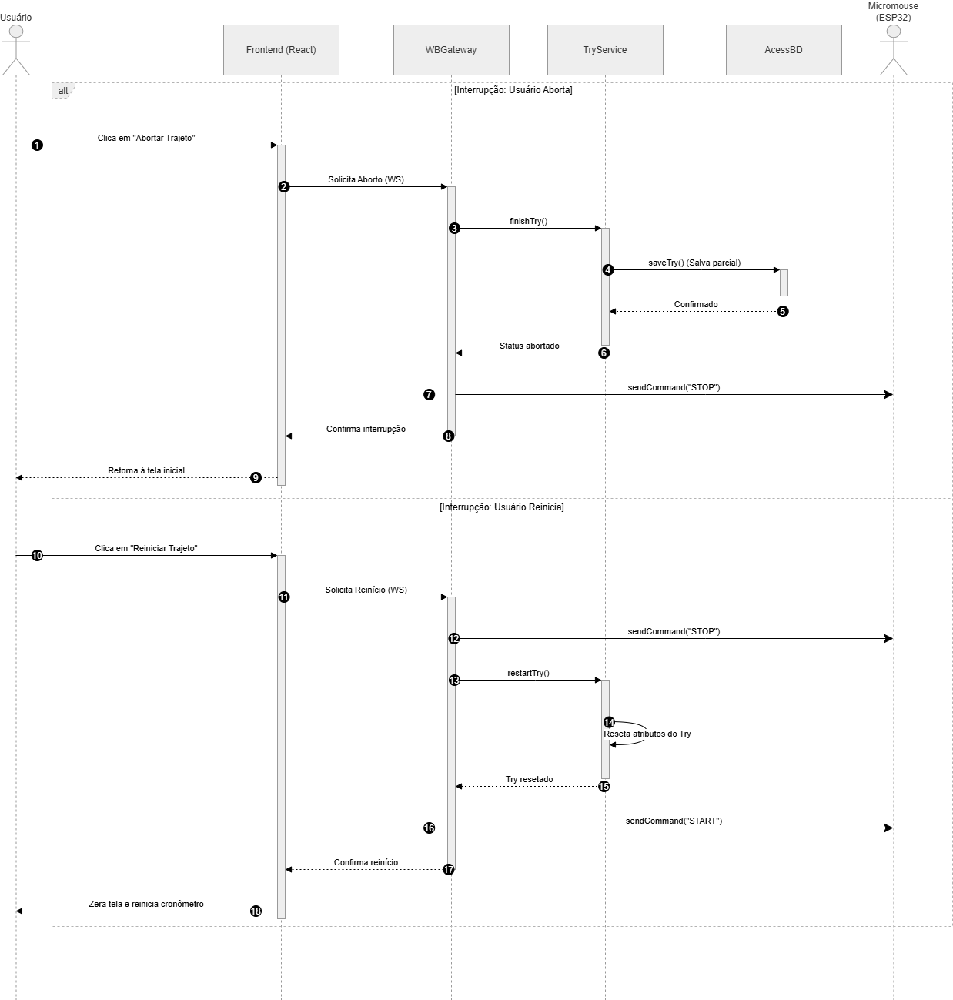
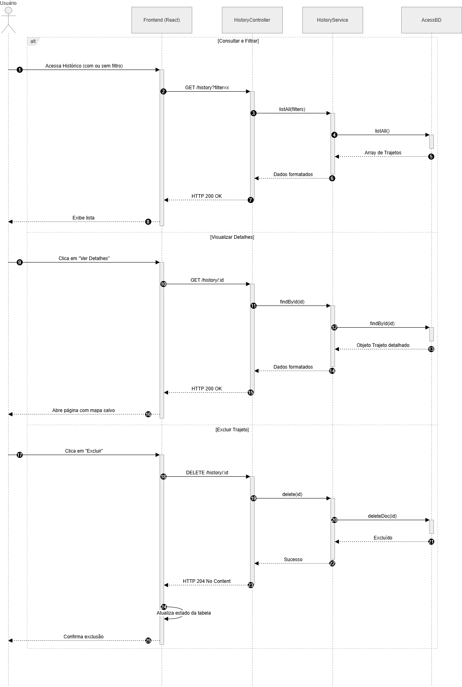
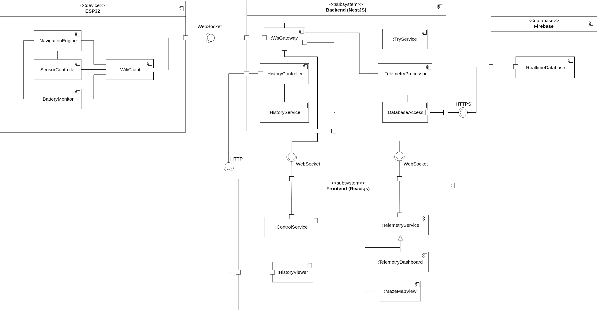
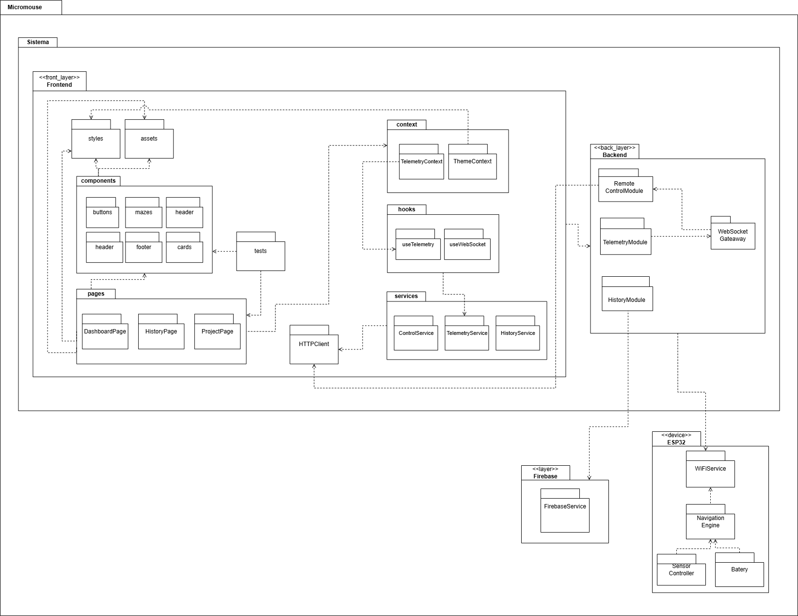
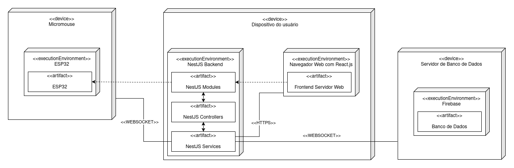
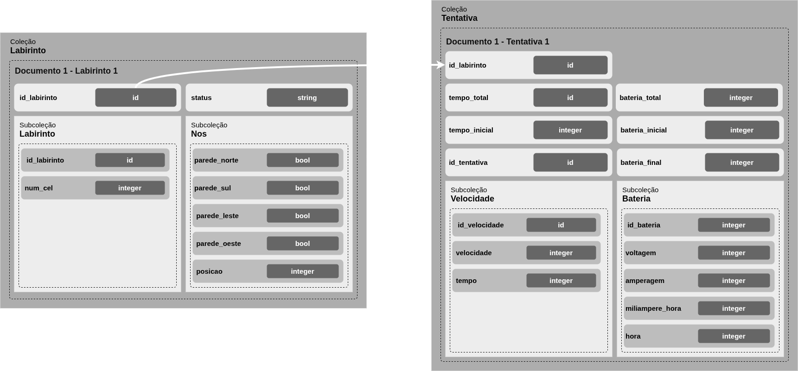

# Descrição de Software

## 1. Visão Lógica do Software

### 1.1 Diagrama de Atividades

O Diagrama de Atividades descreve o comportamento funcional do sistema web do projeto XAROPi. A modelagem utiliza raias (*swimlanes*) para organizar o fluxo e representar a separação entre os subsistemas da arquitetura.

O fluxo demonstra a interação entre o estudante, o sistema web e o hardware do micromouse, contemplando atividades como envio de comandos, processamento de telemetria, renderização do mapa e armazenamento do histórico de execução.

Figura 1 - Diagrama de Atividades de Software XAROPi

  

Fonte: Autoria de <a href="https://github.com/Marjoriemitzi">Marjorie Mitzi</a>

---

### 1.2 Diagrama de Classes

O Diagrama de Classes representa a estrutura lógica do sistema, evidenciando as classes responsáveis pelo gerenciamento da telemetria, comunicação WebSocket, persistência de dados e renderização das informações no frontend.

O modelo também demonstra os relacionamentos entre os módulos do backend, frontend e banco de dados, permitindo visualizar a organização orientada a objetos da aplicação.

Figura 2 - Diagrama de Classes do Sistema

  

Fonte: Autoria de <a href="https://github.com/Isaqzin">Isaque Camargos</a>

---

## 2. Visão de Processos do Software

### 2.1 Diagrama de Sequência: Fluxo de Execução Principal

O diagrama apresenta o fluxo principal de execução do sistema durante uma corrida do micromouse. O modelo demonstra a comunicação em tempo real entre o ESP32, o backend, o frontend e o banco de dados.

A sequência contempla o envio contínuo de telemetria, atualização da interface e persistência automática das informações ao final da execução.

Figura 3 - Diagrama de Sequência: Fluxo de Execução Principal

  

Fonte: Autoria de <a href="https://github.com/Marjoriemitzi">Marjorie Mitzi</a>

---

### 2.2 Diagrama de Sequência: Fluxo de Interrupções e Resets

O diagrama representa os fluxos de interrupção do sistema, contemplando ações de parada manual, reinicialização e abortamento da corrida.

A modelagem evidencia o tratamento de eventos assíncronos e a manutenção da consistência do estado da aplicação durante situações excepcionais.

Figura 4 - Diagrama de Sequência: Fluxo de Interrupções e Resets

  

Fonte: Autoria de <a href="https://github.com/Marjoriemitzi">Marjorie Mitzi</a>

---

### 2.3 Diagrama de Sequência: Recuperação de Histórico

O diagrama demonstra o fluxo de recuperação de execuções armazenadas no banco de dados.

A comunicação entre frontend, backend e Firebase permite consultar trajetos anteriores e apresentar métricas históricas de desempenho do robô.

Figura 5 - Diagrama de Sequência: Recuperação de Histórico

  

Fonte: Autoria de <a href="https://github.com/Marjoriemitzi">Marjorie Mitzi</a>

---

## 3. Visão de Implementação de Software

### 3.1 Diagrama de Componentes

O Diagrama de Componentes apresenta a decomposição arquitetural do sistema em módulos responsáveis pela navegação, telemetria, controle e persistência dos dados.

A modelagem evidencia a interação entre o firmware executado na ESP32, o backend em NestJS, o frontend em React.js e o banco de dados Firebase.

Figura 6 - Diagrama de Componentes

  

Fonte: Autoria de <a href="https://github.com/bolzanMGB">Othavio Araújo Bolzan</a>

---

### 3.2 Diagrama de Pacotes

O Diagrama de Pacotes demonstra a organização hierárquica dos módulos do sistema e seus relacionamentos de dependência.

A estrutura divide o software em pacotes de frontend, backend, firmware da ESP32 e persistência de dados, facilitando a compreensão da arquitetura lógica da aplicação.

Figura 7 - Diagrama de Pacotes

  

Fonte: Autoria de <a href="https://github.com/Samuel">Samuel</a>

---

## 4. Visão de Implantação do Software

### 4.1 Diagrama de Implantação

O Diagrama de Implantação apresenta a disposição física dos componentes do sistema e os canais de comunicação utilizados entre os subsistemas.

A modelagem evidencia a troca de dados via WebSocket entre o micromouse, o sistema web e o Firebase, além da execução do frontend e backend no dispositivo do usuário.

Figura 8 - Diagrama de Implantação do Sistema

  

Fonte: Autoria de <a href="https://github.com/ludmilaaysha">Ludmila Aysha</a>

---

## 5. Visão de Dados

### 5.1 Diagrama de Estrutura de Documentos

O Diagrama de Estrutura de Documentos representa a modelagem dos dados persistidos no Firebase.

A estrutura demonstra a organização das coleções e documentos utilizados para armazenar informações de trajetórias, telemetria, métricas de desempenho e históricos de execução do micromouse.

Figura 9 - Diagrama de Estrutura de Documentos

  

Fonte: Autoria de <a href="https://github.com/bolzanMGB">Othavio Araújo Bolzan</a>

---

## Histórico de Versões

| Versão | Data       | Descrição                 | Autor(es) |
|--------|------------|---------------------------|------------|
| 1.0    | 11/05/2025 | Criação do arquivo        | [Othavio Araújo Bolzan](https://github.com/bolzanMGB) |
| 2.0    | 11/05/2025 | Adição dos diagramas      | [Othavio Araújo Bolzan](https://github.com/bolzanMGB) |