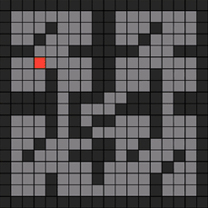

---
hide:
  - navigation
  - toc
  
---

<link rel="stylesheet" href="assets/css/index.css">
<link rel="stylesheet" href="assets/css/team.css">
<link rel="stylesheet" href="assets/css/telemetry.css">
<link rel="stylesheet" href="assets/css/fases.css">
<link rel="stylesheet" href="assets/css/lab-size.css">
<link rel="stylesheet" href="assets/css/algorithm.css">
<link rel="stylesheet" href="assets/css/footer.css">

  <section class="hero">
    

      

        
        
UNB · PROJETO INTEGRADOR · 2026.1

      

      

        <h1>MICROMOUSE   DE COMPETIÇÃO.</h1>
        
Este projeto, desenvolvido na disciplina Projeto Integrador de Engenharia da Universidade de Brasília, tem como objetivo construir um minirrobô autônomo capaz de percorrer e encontrar a saída de labirintos.

        

          <a href="https://github.com/fcte-pi1/2026.1_PI1_Grupo01_Bruno" class="btn-repo1" target="_blank">REPOSITÓRIO DO PROJETO</a>
          <a href="#team-section-start" class="btn-repo2">SOBRE A EQUIPE </a>
        

      

    

  </section>

  <section class="system lab-size-section">
    

      

        

          
// TAMANHOS DE LABIRINTO

          
 

        

        <h1 style="display: align-items: center;text-align: center;">
          OS TRÊS TIPOS  DE LABIRINTO. 
        </h1>
      

      

        

          

            
// NÍVEL 01

            <h2>LABIRINTO 4×4</h2>
          

          

          
16 células. O ponto de entrada para calibração de sensores e validação do algoritmo de busca.

        

        

          

            
// NÍVEL 02

            <h2>LABIRINTO 8×8</h2>
          

          

          
64 células. Exige mapeamento progressivo e otimização de rota durante o percurso.

        

        

          

            
// NÍVEL 03

            <h2>LABIRINTO 16×16</h2>
          

          

          
256 células. Padrão de competição internacional. 

        

      

      
 *Um ponto muito importante é que o ratinho não sabe de antemão o tipo de labirinto, ele precisa descobrir enquanto o explora.

    

  </section>
  
  <section class="system algorithm-section">
    

      

        
// ALGORITMO

        
 

      

      <h1>
          FLOOD FILL, 
           A MELHOR ROTA. 
      </h1>
    

    

      

        

          O flood fill atribui a cada célula um valor que representa a distância até o objetivo. O micromouse sempre se move para a célula vizinha com o menor valor.
        

        

          

            
1

            

              <h3>Inicialização</h3>
              
O objetivo recebe valor 0, enquanto as demais células começam com 
        distâncias altas. 

            

          

          

            
2

            

              <h3>Propagação</h3>
              
Os valores se propagam em ondas a partir do objetivo.

            

          

          

            
3

            

              <h3>Navegação</h3>
              
O micromouse segue o gradiente decrescente até chegar ao objetivo.

            

          

          

            
4

            

              <h3>Atualização dinâmica</h3>
              
Ao descobrir nova parede, o mapa é recalculado em tempo real.

            

          

        

      

      

        

          
        

      

    

  </section>

  

  <section class="telemetry-section-custom">
    

      

        
// INTERFACE WEB

        

      

    

    

      

        <h1>
          TELEMETRIA 
           EM TEMPO REAL. 
        </h1>
        

          O sistema web exibe, via WebSocket e em tempo real, o mapeamento do labirinto, a identificação do tipo de percurso, a posição do micromouse, o nível de bateria, a velocidade média e o status da execução, com atualização contínua e baixa latência.
        

        

          
        

      

      

        

          
XAROPI · LIVE

          

            
            CONNECTED
          

        

        

      

        

        

        

        

        

        

        

        

        

        

        

        

        

        

        

        

        

        

        

        

        

        

        

        

        

        

        

        

        

        

        

        

        

        

        

        

        

        

        

        

        

        

        

        

        

        

        

        

        

        

        

        

        

        

        

        

        

        

        

        

        

        

        

        

      

        

          

            <h2>73%</h2>
            
BATERIA

            

              

            

          

          

            <h2>0.42m/s</h2>
            
VELOCIDADE

          

          

            <h2>1:47</h2>
            
TEMPO

          

        

      

    

  </section>

  <section class="system">
    

      

        
// COMO FUNCIONA

        
 

      

      <h1>
          TRÊS FASES, 
           UM CAMINHO. 
      <h1>
    

    

      

        

          

            <svg xmlns="http://www.w3.org/2000/svg" width="24" height="24" viewBox="0 0 24 24" fill="none" stroke="#FF5722" stroke-width="2" stroke-linecap="round" stroke-linejoin="round"><circle cx="11" cy="11" r="8"></circle><line x1="21" y1="21" x2="16.65" y2="16.65"></line></svg>
          

          01
        

        
SENSORES · HARDWARE · RESPOSTA

        

          <h3>EXPLORA</h3>
          <ul>
            <li>Sensores infravermelhos</li>
            <li>Detecção de paredes </li>
            <li>Atualização < 10ms</li>
          </ul>
        

      

      

        

          

          <svg xmlns="http://www.w3.org/2000/svg" viewBox="0 0 24 24" fill="none" stroke="#FF5722" stroke-width="2" stroke-linecap="round" stroke-linejoin="round"><rect x="4" y="4" width="16" height="16" rx="2" ry="2"></rect><rect x="9" y="9" width="6" height="6"></rect><line x1="9" y1="1" x2="9" y2="4"></line><line x1="15" y1="1" x2="15" y2="4"></line><line x1="9" y1="20" x2="9" y2="23"></line><line x1="15" y1="20" x2="15" y2="23"></line><line x1="20" y1="9" x2="23" y2="9"></line><line x1="20" y1="15" x2="23" y2="15"></line><line x1="1" y1="9" x2="4" y2="9"></line><line x1="1" y1="15" x2="4" y2="15"></line></svg>
          

          02
        

        
ALGORITMO · GRAFOS · WEBSOCKET

        

          <h3>CALCULA</h3>
        <ul>
            <li>Algoritmo de navegação que explora o labirinto</li>
            <li>Identificação do tipo de labirinto</li>
            <li>Construção Progressiva do grafo</li>
            <li>Dados de mapeamento transmitidos via WebSocket</li>
          </ul>
        

      

      

        

          

          <svg xmlns="http://www.w3.org/2000/svg" width="24" height="24" viewBox="0 0 24 24" fill="none" stroke="#FF5722" stroke-width="2" stroke-linecap="round" stroke-linejoin="round"><polygon points="13 2 3 14 12 14 11 22 21 10 12 10 13 2"></polygon></svg>
          

          03
        

        
OUTPUT · MOVIMENTO · PRECISÃO

        

          <h3>EXECUTA</h3>
          <ul>
            <li>Motores DC </li>
            <li>Controle por PWM independente</li>
            <li>Curvas de 90° e 180°</li>
            <li>Centralização no corredor</li>
          </ul>
        

      

    

  </section>
  

  <section class="system team-section" >
    

      

        
// EQUIPE

        
 

      

      <h1>
          QUATRO FRENTES, 
           UM OBJETIVO. 
      </h1>
    

    <!-- ESTRUTURAS -->
    

        

          <svg class="team-icon" xmlns="http://www.w3.org/2000/svg" viewBox="0 0 24 24" fill="none" stroke="#FF5722" stroke-width="2" stroke-linecap="round" stroke-linejoin="round"> <polyline points="9 6 3 12 9 18"/><polyline points="15 6 21 12 15 18"/></svg>
          <h2 class="team-title">// 01.   Estruturas</h2>
        

        

            

                
                

                    <h3>Davi Marques</h3>
                    
Líder do Projeto

                    
23/1030421

                    <a href="https://github.com/DaviMarques" target="_blank">@DaviMarques</a>
                

            

            

                
                

                    <h3>Samara Sardinha</h3>
                    
Líder da Equipe

                    
23/1011829

                    <a href="https://github.com/sardinhasamara-png" target="_blank">@sardinhasamara-png</a>
                

            

            

                
                

                    <h3>Gabriela Assis</h3>
                    
Tesoureira

                    
24/2015192

                    <a href="https://github.com/gabfreitasss" target="_blank">@gabfreitasss</a>
                

            

            

                
                

                    <h3>Luís Henrique</h3>
                    
Membro

                    
24/2004869

                    <a href="https://github.com/Donnk61" target="_blank">@Donnk61</a>
                

            

        

    

    <!-- ENERGIA -->
    

        

          <svg class="team-icon" xmlns="http://www.w3.org/2000/svg" viewBox="0 0 24 24" fill="none" stroke="#FF5722" stroke-width="2" stroke-linecap="round" stroke-linejoin="round"><polygon points="13 2 3 14 11 14 9 22 21 9 13 9 13 2"/></svg>
          <h2 class="team-title">// 02.   Energia</h2>
        

        

            

                
                

                    <h3>Letícia Geovana</h3>
                    
Líder da Equipe

                    
23/1026868

                    <a href="https://github.com/leticiacarvalho-lg" target="_blank">@leticiacarvalho-lg</a>
                

            

            

                
                

                    <h3>Felipe Júnior</h3>
                    
Membro

                    
23/1012192

                    <a href="https://github.com/Felipej3ds" target="_blank">@Felipej3ds</a>
                

            

            

                
                

                    <h3>Laís Cecília</h3>
                    
Membro

                    
21/1029512

                    <a href="https://github.com/Laisczt" target="_blank">@Laisczt</a>
                

            

            

                
                

                    <h3>Samuel Felipe</h3>
                    
Membro

                    
23/2022148

                    <a href="https://github.com/TerminaKng05" target="_blank">@TerminaKng05</a>
                

            

        

    

    <!-- HARDWARE -->
    

        

          <svg class="team-icon" xmlns="http://www.w3.org/2000/svg" viewBox="0 0 24 24" fill="none" stroke="#FF5722" stroke-width="2" stroke-linecap="round" stroke-linejoin="round"><rect x="7" y="7" width="10" height="10" rx="1"/><line x1="3" y1="9" x2="7" y2="9"/><line x1="3" y1="12" x2="7" y2="12"/><line x1="3" y1="15" x2="7" y2="15"/><line x1="17" y1="9" x2="21" y2="9"/><line x1="17" y1="12" x2="21" y2="12"/><line x1="17" y1="15" x2="21" y2="15"/><line x1="9" y1="3" x2="9" y2="7"/><line x1="12" y1="3" x2="12" y2="7"/><line x1="15" y1="3" x2="15" y2="7"/><line x1="9" y1="17" x2="9" y2="21"/><line x1="12" y1="17" x2="12" y2="21"/><line x1="15" y1="17" x2="15" y2="21"/></svg>
          <h2 class="team-title">// 03.   Hardware</h2>
        

        

            

                
                

                    <h3>Gabriel Celestino</h3>
                    
Líder da Equipe

                    
23/1027079

                    <a href="https://github.com/Gabreeles" target="_blank">@Gabreeles</a>
                

            

            

                
                

                    <h3>Rafael Welz</h3>
                    
Gestão de Pessoas

                    
23/1011800

                    <a href="https://github.com/RafaelSchadt" target="_blank">@RafaelSchadt</a>
                

            

            

                
                

                    <h3>João Victor</h3>
                    
Membro

                    
23/1011560

                    <a href="https://github.com/JtAires" target="_blank">@JtAires</a>
                

            

            

                
                

                    <h3>Jorge Henrique</h3>
                    
Membro

                    
23/1011570

                    <a href="https://github.com/SirJorgito" target="_blank">@SirJorgito</a>
                

            

            

                
                

                    <h3>Luana Carvalho</h3>
                    
Membro

                    
24/2004840

                    <a href="https://github.com/luanaa2005" target="_blank">@luanaa2005</a>
                

            

        

    

    <!--  SOFTWARE -->
    

        

          <svg class="team-icon" xmlns="http://www.w3.org/2000/svg" viewBox="0 0 24 24" fill="none" stroke="#FF5722" stroke-width="2" stroke-linecap="round" stroke-linejoin="round"><polygon points="13 2 3 14 11 14 9 22 21 9 13 9 13 2"/></svg>
          <h2 class="team-title">// 04.   Software</h2>
        

        

            

                
                

                    <h3>Ludmila Aysha</h3>
                    
Líder da Equipe

                    
23/1026750

                    <a href="https://github.com/ludmilaaysha" target="_blank">@ludmilaaysha</a>
                

            

            

                
                

                    <h3>Isaque Camargos</h3>
                    
Vice-Líder do Projeto

                    
23/1011515

                    <a href="https://github.com/Isaqzin" target="_blank">@Isaqzin</a>
                

            

            

                
                

                    <h3>Marjorie Mitzi</h3>
                    
Membro

                    
23/1039140

                    <a href="https://github.com/Marjoriemitzi" target="_blank">@Marjoriemitzi</a>
                

            

            

                
                

                    <h3>Othavio Araújo</h3>
                    
Membro

                    
23/1039150

                    <a href="https://github.com/bolzanMGB" target="_blank">@bolzanMGB</a>
                

            

        

    

  </section>

<footer class="terminal-footer">
    

      

        <h2 class="footer-logo">XAROPi</h2>
        
Micromouse · Projeto Integrador de Engenharia · UnB · FCTE · 2026.1

      

      

        
Universidade de Brasília

        
Faculdade do Gama

      
  
    

  </footer>